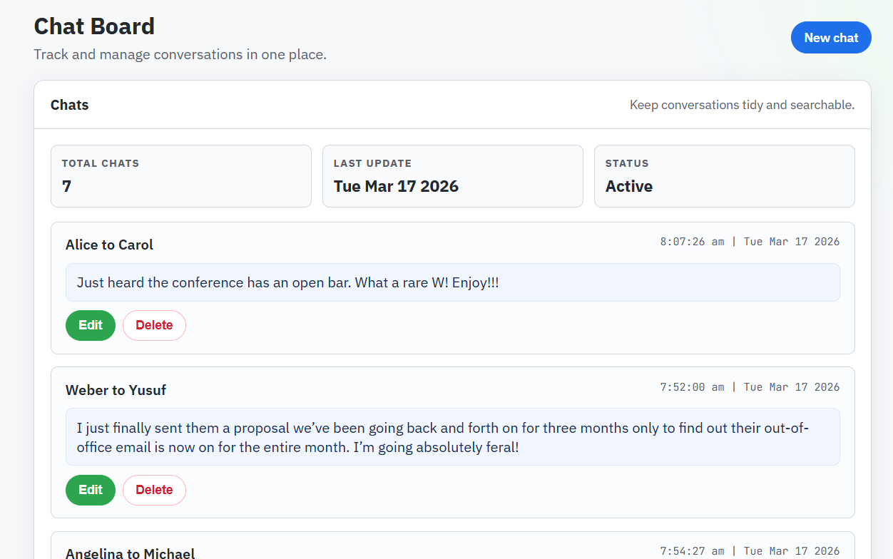

# basic-crud-application-mongodb

A clean MongoDB CRUD chat app with a GitHub-inspired UI.

## Preview



## Features
- Create, read, update, and delete chats
- MongoDB + Express + EJS stack
- Clean, responsive UI

## Setup
1. Install dependencies
2. Start the server

```
npm install
node index.js
```

## Tech Stack
- Node.js
- Express
- MongoDB
- EJS
